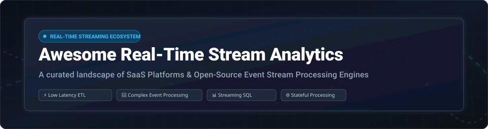

# Awesome Real-Time Stream Analytics 🚀📊⚡

    

> **Curated landscape of Real-Time Event Stream Processing (ESP), Complex Event Processing (CEP), Streaming SQL, and Stream Analytics SaaS Platforms & Open-Source Projects.** 🌟

*Last updated: October 2026* 📅

---

## 📌 Executive Overview & Market Dynamics 📈

The global **Real-Time Stream Analytics Market** is estimated at **$28.5 Billion (2026)** and is projected to grow at a CAGR of ~26.5% through 2030. 💰

### 🏗️ Market Structure & Fragmentation
- **Highly Fragmented to Moderately Concentrated Hybrid Ecosystem**:
  - **Cloud Infrastructure & Enterprise Streaming (Concentrated)** ☁️: Hyperscalers (AWS, Azure, Google Cloud) and enterprise streaming providers (Confluent, Databricks) dominate infrastructure, storage, and managed orchestration.
  - **Application-Layer & Open-Source Engines (Highly Fragmented)** 🧩: The engine, streaming SQL, and pipeline routing layers feature fierce competition among specialized engines (Apache Flink, Spark Structured Streaming, RisingWave, Materialize, Redpanda, Arroyo, Vector, Benthos). No single vendor owns end-to-end stream processing, making interoperability and open standards crucial.

---

## 📑 Table of Contents 📖

- [Executive Overview & Market Dynamics](#-executive-overview--market-dynamics-) 📌
- [SaaS / Managed Stream Analytics Platforms](#-saas--managed-stream-analytics-platforms-) ☁️
- [Open-Source Stream Processing Projects](#-open-source-stream-processing-projects-) 🔓
- [Stream Analytics Architecture & Tool Selection Guide](#-stream-analytics-architecture--tool-selection-guide-) 🛠️
- [How to Contribute](#-how-to-contribute-) 🤝
- [Support & Sponsorship](#-support--sponsorship-) 💖
- [Star History](#-star-history-) ⭐
- [License & Disclaimer](#-license--disclaimer-) 📄

---

## ☁️ SaaS / Managed Stream Analytics Platforms 🌐

Below is a curated comparison of leading commercial stream analytics platforms, ordered by **Market Cap / Enterprise Valuation (Descending)**. 💎

| Platform | Market Size / Valuation | Starting Pricing Tier | Free Tier / Trial Limit | Key Focus & Capabilities |
| :--- | :--- | :--- | :--- | :--- |
| **[Microsoft Azure Stream Analytics](https://azure.microsoft.com/en-us/products/stream-analytics/)** 🔷 | **~$3.1 Trillion** *(Microsoft Cap)* | **$0.11 / Streaming Unit (SU)-hour** | **$200 free credit** (valid 30 days) + 55+ free services for 12 months | Managed real-time analytics with SQL-like query language, built-in ML functions, and native Azure IoT & Event Hubs integration. |
| **[Google Cloud Dataflow](https://cloud.google.com/dataflow)** 🟡 | **~$2.1 Trillion** *(Alphabet Cap)* | **$0.056 / vCPU-hour** + $0.0036/GB memory-hour | **$300 free trial credit** (valid 90 days) + Always Free quotas on select GCP services | Unified batch & stream processing based on Apache Beam. Execute auto-scaling pipelines with low operational overhead. |
| **[Amazon Kinesis Data Analytics](https://aws.amazon.com/kinesis/data-analytics/)** *(Managed Service for Apache Flink)* 🟧 | **~$2.0 Trillion** *(Amazon Cap)* | **$0.11 / Kinesis Processing Unit (KPU)-hour** ($79.20/mo per KPU) | **AWS Free Tier**: $1000 AWS Cloud Credits via Activate / 12-month free tier for select AWS services | Serverless Apache Flink application runtime. Continuously process streaming data using SQL, Java, Scala, or Python. |
| **[Databricks Streaming](https://www.databricks.com/)** 🧱 | **~$43 Billion** *(Private Valuation)* | **$0.15 / DBU** (Serverless Data Compute Units) | **14-day free trial** with full platform access (cloud infrastructure charges apply) | Lakehouse streaming with Spark Structured Streaming, Delta Live Tables (DLT), and continuous ingestion pipelines. |
| **[Confluent Cloud](https://www.confluent.io/confluent-cloud/)** 🌊 | **~$7.2 Billion** *(Public Market Cap)* | **$0.00 / hr base** (pay-as-you-go throughput from $0.10/GB) | **$400 free credit** for first 30 days | Enterprise Kafka platform with managed Apache Flink, ksqlDB, 120+ cloud connectors, and governance. |
| **[Hazelcast Cloud](https://hazelcast.com/)** ⚡ | **~$350 Million** *(Est. Valuation)* | **$0.80 / hour** (Pay-as-you-go standard cluster) | **$50 free trial credit** on signup (no credit card required) | Low-latency stateful stream processing co-located with an in-memory data grid (IMDG) for real-time applications. |
| **[StreamNative](https://streamnative.io/)** 🌌 | **~$150 Million** *(Est. Valuation)* | **$0.40 / cluster-hour** (Pay-as-you-go Developer tier) | **30-day free trial** or **$300 free cloud credits** | Fully managed Apache Pulsar and Apache Flink platform for enterprise event-driven architectures. |
| **[Decodable](https://www.decodable.co/)** 🧩 | **~$100 Million** *(Est. Valuation)* | **$0.25 / VKPU-hour** (Virtual KPU) | **100 free processing hours** every month (Free tier) | Developer-centric SQL stream processing platform built on Apache Flink for real-time ETL and pipeline automation. |
| **[Upsolver](https://www.upsolver.com/)** 🔄 | **~$90 Million** *(Est. Valuation)* | **$0.09 / Upsolver Unit (USU)-hour** | **14-day unlimited free trial** | No-code/low-code streaming data lake platform for ingesting, transforming, and outputting stream data to S3, Snowflake, and Iceberg. |

---

## 🔓 Open-Source Stream Processing Projects 💻

Below are top open-source projects for event stream processing, stream SQL, and data routing, sorted by **GitHub Stars_Count (Descending)**. 🌟

| Project | GitHub_Stars | License | Key Highlights & Primary Use Cases |
| :--- | :---: | :---: | :--- |
| **[Apache Spark](https://github.com/apache/spark)** ⚡ |  | Apache-2.0 | **Unified batch & stream engine**: Micro-batch processing with DataFrame/Dataset API, Delta Lake integration, and machine learning libraries. |
| **[Apache Kafka](https://github.com/apache/kafka)** *(Kafka Streams)* 📡 |  | Apache-2.0 | **Distributed event streaming platform**: Includes **Kafka Streams**, a lightweight client library for stateful stream processing without separate clusters. |
| **[Apache Flink](https://github.com/apache/flink)** 🐿️ |  | Apache-2.0 | **Stateful stream processing standard**: True event-at-a-time processing, low-latency windowing, exactly-once guarantees, and savepoints. |
| **[ClickHouse](https://github.com/ClickHouse/ClickHouse)** 🏠 |  | Apache-2.0 | **Real-time analytical DBMS**: High-throughput columnar database with native Kafka/RabbitMQ streaming ingestion and materialized views. |
| **[Vector](https://github.com/vectordotdev/vector)** 🎯 |  | MPL-2.0 | **High-performance observability pipeline**: Rust-based agent for collecting, transforming, and routing logs, metrics, and event streams. |
| **[Apache Druid](https://github.com/apache/druid)** 💧 |  | Apache-2.0 | **Real-time analytical database**: Sub-second OLAP queries on streaming data sources with native Kafka and Pulsar connectors. |
| **[Apache Pulsar](https://github.com/apache/pulsar)** 💫 |  | Apache-2.0 | **Cloud-native messaging & streaming**: Built-in multi-tenancy, tiered storage (S3/GCS), and Pulsar Functions for lightweight processing. |
| **[Apache NiFi](https://github.com/apache/nifi)** 🌊 |  | Apache-2.0 | **Visual dataflow automation**: Powerful drag-and-drop platform for directing, transforming, and managing real-time data pipelines. |
| **[Redpanda](https://github.com/redpanda-data/redpanda)** 🐼 |  | BSL-1.1 | **C++ Kafka-compatible streaming engine**: JVM-free, ZooKeeper-free event streaming platform built for low latency and operational simplicity. |
| **[QuestDB](https://github.com/questdb/questdb)** 🚀 |  | Apache-2.0 | **Time-series database with streaming SQL**: Optimized for ultra-fast time-series ingestion via Influx Line Protocol and SQL query engine. |
| **[Redpanda Connect](https://github.com/redpanda-data/connect)** *(formerly Benthos)* 🔌 |  | Apache-2.0 | **Declarative stream processor**: No-code/low-code YAML streaming pipelines connecting hundreds of sources, sinks, and transformations. |
| **[Apache Beam](https://github.com/apache/beam)** 🌉 |  | Apache-2.0 | **Portable pipeline programming model**: Write unified batch/stream pipelines in Java, Python, or Go, and run on Flink, Spark, or Dataflow. |
| **[RisingWave](https://github.com/risingwavelabs/risingwave)** 🌊 |  | Apache-2.0 | **Distributed streaming database**: PostgreSQL-compatible SQL streaming database for real-time materialized views and continuous ETL. |
| **[Materialize](https://github.com/MaterializeInc/materialize)** 👁️ |  | BSL-1.1 | **Streaming database on Timely Dataflow**: PostgreSQL-compatible operational data store providing active SQL queries with instant updates. |
| **[Arroyo](https://github.com/ArroyoSystems/arroyo)** 🦀 |  | Apache-2.0 | **Rust-based stream engine**: Distributed SQL-first stream processing engine designed for high performance, safety, and serverless scaling. |
| **[ksqlDB](https://github.com/confluentinc/ksql)** 🗄️ |  | Confluent Community | **Streaming SQL engine for Apache Kafka**: Enables building real-time stream processing applications using intuitive SQL queries. |
| **[Memgraph](https://github.com/memgraph/memgraph)** 🕸️ |  | Apache-2.0 | **In-memory streaming graph database**: Perform real-time graph analytics and pathfinding algorithms directly on Kafka/Pulsar data streams. |
| **[Hazelcast Platform](https://github.com/hazelcast/hazelcast)** 🌰 |  | Apache-2.0 | **In-memory computing platform**: Combines stream processing engine (formerly Hazelcast Jet) with distributed state storage. |
| **[Apache Storm](https://github.com/apache/storm)** 🌩️ |  | Apache-2.0 | **Pioneer distributed real-time engine**: Low-latency event processing topology system (historically significant, maintained by ASF). |
| **[Apache Samza](https://github.com/apache/samza)** 💼 |  | Apache-2.0 | **Stateful stream framework from LinkedIn**: Optimized for heavy stateful processing, Kafka streams, and YARN/Kubernetes deployments. |

---

## 🛠️ Stream Analytics Architecture & Tool Selection Guide 💡

Choosing the right real-time processing engine depends on your **latency requirements**, **state complexity**, and **operational stack**:

1. **Stateful Processing at Scale** ⚖️: Use **[Apache Flink](https://github.com/apache/flink)** or **[Confluent Cloud](https://www.confluent.io/confluent-cloud/)** for millisecond-latency event processing, complex session windows, and robust state recovery (savepoints).
2. **Kafka-Native Ecosystems** 📡: Choose **[Kafka Streams](https://github.com/apache/kafka)** for embedded Java library processing or **[ksqlDB](https://github.com/confluentinc/ksql)** for SQL-based Kafka transformations.
3. **Streaming SQL & Real-Time Dashboards** 📊: Implement **[RisingWave](https://github.com/risingwavelabs/risingwave)** or **[Materialize](https://github.com/MaterializeInc/materialize)** to query live data with familiar PostgreSQL syntax and incrementally updated materialized views.
4. **Log & Observability Pipelines** 🔍: Use **[Vector](https://github.com/vectordotdev/vector)** or **[Redpanda Connect / Benthos](https://github.com/redpanda-data/connect)** for high-throughput, low-resource declarative data routing.
5. **Unified Batch & Stream** 🔄: Opt for **[Apache Spark](https://github.com/apache/spark)** or **[Databricks Streaming](https://www.databricks.com/)** to share code across batch analytics and micro-batch stream processing.

---

## 🤝 How to Contribute 🛠️

Contributions are welcome! Please follow these guidelines:
1. Fork the repository and create a feature branch.
2. Edit `README.md` keeping formatting consistent (include name, URL, short summary, license, and relevant metrics).
3. Open a Pull Request detailing your changes.

---

## 💖 Support & Sponsorship ☕

Thank you for visiting this repository! If you find this curated list helpful for your research, projects, or enterprise architecture decisions, please consider supporting the project:

- ⭐ **Star this repository** to help others discover it!
- 🍴 **Fork it** and contribute your favorite stream processing tools or improvements.
- 📢 **Share it** with fellow data engineers, architects, and open-source enthusiasts.
- ☕ **Buy me a coffee**: If you'd like to support ongoing maintenance and new developer resources, feel free to sponsor via the [GitHub Sponsor Dashboard](https://github.com/sponsors/ishandutta2007).

---

## ⭐ Star History

---

## 📄 License & Disclaimer ⚖️

- **License**: Community curated resources published under the [MIT License](LICENSE).
- **Vendor Licensing Notes**: Verify licensing terms for proprietary/BSL components (e.g., ksqlDB uses Confluent Community License, Materialize and Redpanda use BSL).
- **Disclaimer**: Listing does not imply commercial endorsement. Perform proper security and enterprise compliance evaluations before production deployment.

---

  <b>Built with ❤️ for Data Engineers, Stream Architects, and Systems Developers worldwide.</b>

